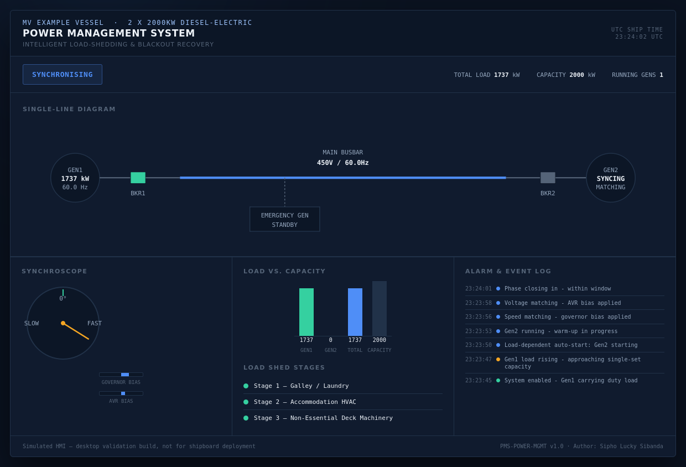
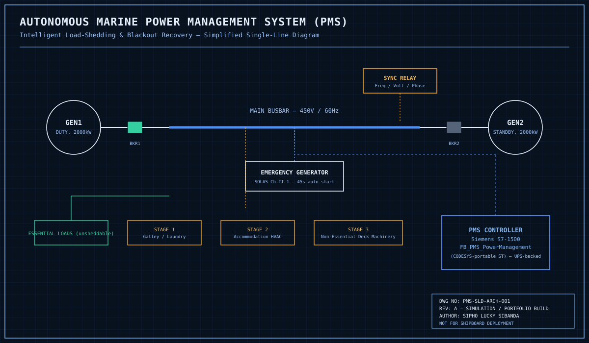

# ⚓ Autonomous Marine Power Management System (PMS)
### Intelligent Load-Shedding & Blackout Recovery


**Author:** Sipho Lucky Sibanda
**Series:** Marine Automation Portfolio — Project 03 (see also [Project 01 — EGCS]((https://hangmanlucky.github.io/marine-egcs-scrubber-control/) and [Project 02 — FGSS ESD](https://hangmanlucky.github.io/marine-lng-fgss-esd/)

---

## 🌍 Marine Context — Why This Matters

If a ship loses total electrical power at sea — a **blackout** — it drifts, steering
gear goes dead, and it becomes a collision and grounding risk until power is
restored. Modern vessels defend against this with a **Power Management System**:
software that watches every generator on the busbar and reacts to trouble faster
than a human operator ever could, in three distinct ways covered by this project.

## 🔧 What This Project Does

`FB_PMS_PowerManagement` is a PLC function block (IEC 61131-3 Structured Text) that:

- **Sheds non-essential load in milliseconds** the instant a generator trips
  unexpectedly — before the remaining generator's own overload protection has a
  chance to trip it too and cascade into a full blackout
- **Auto-synchronises** a standby generator onto a live busbar: starts it, matches
  its speed and voltage to the bus, waits for the correct phase-angle window, and
  closes the breaker — entirely without an operator touching a governor or AVR knob
- **Recovers from a full blackout automatically**: starts the emergency generator per
  SOLAS's 45-second requirement, black-starts the main plant onto the now-confirmed
  dead bus, and restores load in controlled stages so the freshly-started plant is
  never hit with a sudden full load

## 🖥️ HMI — Switchboard Console

The `index.html` mockup is built around a single-line diagram (the standard way
electrical engineers visualise a switchboard) plus a live **synchroscope** — the
classic rotating-needle dial real synchronising panels use to show phase alignment.
It runs a full scripted demo on a loop: rising load &rarr; auto-sync &rarr; parallel
running &rarr; full blackout &rarr; emergency generator &rarr; black-start &rarr;
staged restoration.



## 🗺️ System Architecture



Two generators feed a common busbar through breakers; a synchronising relay
supervises any live paralleling attempt. Essential loads (steering gear, navigation,
fire pumps) are wired on an unsheddable section of the switchboard — never through a
load-shed stage. The emergency generator sits on its own independent branch per
SOLAS.

## ⚙️ Key Engineering Concepts

| Concept | How it's implemented |
|---|---|
| Fast load shedding | Edge-triggered on an unexpected breaker-open, sheds pre-defined load blocks with no iterative calculation — there's no time for one |
| Load-dependent auto-start | Proactively brings a second generator online *before* an overload, distinct from the reactive shed above |
| Auto-synchronising | A seven-state sequence (start → warm-up → speed match → voltage match → phase match → close → parallel) with a hard timeout at every stage |
| Dead-bus close vs. live sync | Two different, deliberately separate code paths — closing onto a *confirmed dead* bus never goes through phase-matching logic |
| Staged blackout recovery | Load is restored in the reverse order it was shed, each stage gated by a timer, never all at once |

## 📁 Repository Structure

```
marine-pms-loadshare/
├── README.md
├── src/
│   └── PMS_PowerManagement.st        # IEC 61131-3 Structured Text PMS logic
├── docs/
│   ├── IO_List.md                    # Full I/O list with tags & addresses
│   └── Testing_Procedures.md         # FAT-style functional test cases
├── hmi/
│   └── index.html                    # Switchboard console with live synchroscope
└── images/
    ├── architecture_diagram.svg      # Single-line diagram
    └── hmi-dashboard.png             # Rendered HMI screenshot
```

## 📄 Documentation

- [I/O List](IO_List.md)
- [Functional Test Procedures](Testing_Procedures.md)
- [Full Technical Manual (PDF)](PMS_Technical_Manual.pdf) — 30-page project ebook covering SOLAS Ch.II-1 context, architecture, hardware, the three-linked-problems control philosophy, full annotated code, HMI design with a live synchroscope, alarm philosophy, testing/commissioning, and a HAZOP-style hazard register

## ⚠️ Disclaimer

This is a **simulation and portfolio project**. It is not certified, has not been
tested against real hardware, and must not be used as a basis for an actual
shipboard Power Management System. A real installation requires class society
approval, real generator/governor/AVR characterisation, and full load-sharing
(droop) control beyond this function block's scope.

## 👤 Author

**Sipho Lucky Sibanda**
Automation & Controls Portfolio — Marine, Industrial & Applied Systems

---
